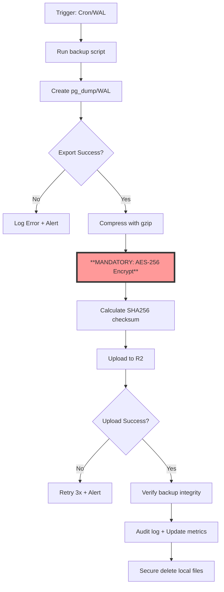
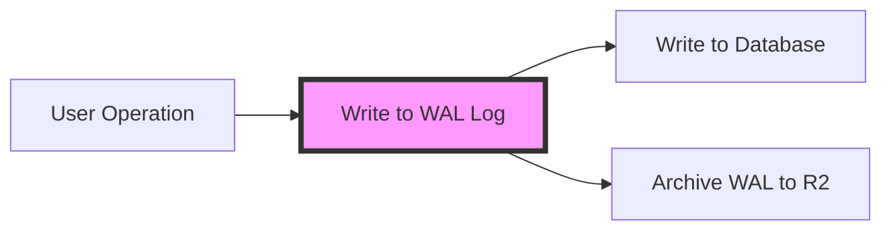

# PostgreSQL Database Backup to Cloudflare R2 - Design Document

## Executive Summary

This document outlines the design and implementation plan for automating PostgreSQL database backups to Cloudflare R2 object storage. The backup system ensures data durability and disaster recovery capabilities for the HybridInference production environment.

**Status**: Design Phase
**Owner**: Infrastructure Team
**Last Updated**: 2025-10-27

---

## 1. Background and Requirements

### 1.1 Problem Statement

The current production server has **no automated backup mechanism**. Without backups:
- Hardware failures could result in permanent data loss
- Accidental data deletion/corruption cannot be recovered
- No point-in-time recovery (PITR) capability
- Single point of failure for critical business data

### 1.2 Business Requirements

| Requirement | Target | Priority |
|------------|--------|----------|
| Recovery Point Objective (RPO) | ≤ 24 hours | P0 |
| Recovery Time Objective (RTO) | ≤ 4 hours | P1 |
| Backup Retention | 30 days | P0 |
| Backup Verification | Weekly | P1 |
| Cost Efficiency | < $50/month | P2 |

### 1.3 Current Database Schema

The system uses PostgreSQL with the following key tables:
- `api_logs` - API request logs and metrics
- `api_stats_hourly` - Aggregated hourly statistics
- `api_keys` - User authentication and quota management
- `admin_audit_log` - Administrative action tracking

**Estimated Data Growth**: ~100MB-1GB per day (depending on traffic)

---

## 2. Technology Selection: Cloudflare R2

### 2.1 Why R2 vs Alternatives

| Feature | R2 | AWS S3 | Self-hosted |
|---------|----|----|------------|
| Storage Cost | $0.015/GB | $0.023/GB | Server cost |
| Egress Cost | **$0** | $0.09/GB | Free |
| API Compatibility | S3-compatible | Native S3 | N/A |
| Setup Complexity | Low | Low | High |
| **Total Monthly Cost** (100GB) | **$1.50** | $10.50+ | $20+ |

**Verdict**: R2 provides the best cost-performance ratio, especially for disaster recovery scenarios where you may need to download large backups.

### 2.2 R2 Features Used

- **S3-compatible API**: Use existing tools (pg_dump, rclone, boto3)
- **Versioning**: Protect against accidental deletion
- **Lifecycle Policies**: Automatic deletion of old backups
- **Global Replication**: Built-in data durability (multi-region)

---

## 3. Architecture Design

### 3.1 System Overview

```
┌──────────────────┐
│  PostgreSQL DB   │
│                  │
│  - api_logs      │
│  - api_keys      │
│  - api_stats     │
└────────┬─────────┘
         │
         │ pg_dump (daily cron)
         ▼
┌──────────────────┐
│  Backup Script   │
│                  │
│  - Compress      │
│  - Encrypt (opt) │
│  - Upload        │
└────────┬─────────┘
         │
         │ S3 API (boto3)
         ▼
┌──────────────────┐
│   Cloudflare R2  │
│                  │
│  Retention: 30d  │
│  Versioning: On  │
└──────────────────┘
         │
         │ Monitoring
         ▼
┌──────────────────┐
│  Alerting System │
│  - Email/Slack   │
│  - Backup Status │
└──────────────────┘
```

### 3.2 Backup Workflow



---

## 4. Detailed Implementation

### 4.1 Directory Structure

```
infrastructure/
├── backup/
│   ├── backup_to_r2.py          # Main backup script
│   ├── restore_from_r2.py       # Restore script
│   ├── verify_backup.py         # Backup verification
│   ├── config.yaml              # Backup configuration
│   └── requirements.txt         # Python dependencies
├── monitoring/
│   └── backup_monitor.py        # Health check script
└── README.md                     # Usage documentation
```

### 4.2 Core Components

#### 4.2.1 Backup Script (`backup_to_r2.py`)

**Key Responsibilities**:
1. Execute `pg_dump` with optimal settings
2. Compress backup file (gzip)
3. Upload to R2 with metadata
4. Cleanup old local backups
5. Send notifications on failure

**Backup Filename Convention**:
```
db_backups/
├── daily/
│   ├── hybridinference_2025-10-27_020000.sql.gz
│   └── hybridinference_2025-10-26_020000.sql.gz
├── weekly/
│   └── hybridinference_2025-10-21_weekly.sql.gz
└── monthly/
    └── hybridinference_2025-10-01_monthly.sql.gz
```

#### 4.2.2 Restore Script (`restore_from_r2.py`)

**Features**:
- List available backups from R2
- Download and decompress backup
- Optionally restore to a different database (for testing)
- Support point-in-time restore (if WAL archiving is enabled)

#### 4.2.3 Verification Script (`verify_backup.py`)

**Verification Steps**:
1. Download latest backup from R2
2. Restore to temporary test database
3. Run integrity checks (table counts, key constraints)
4. Compare checksums
5. Cleanup temporary database

---

## 5. WAL Archiving - Critical for OpenRouter Service

### 📝 5.1 What is WAL Archiving?

**WAL = Write-Ahead Logging**

Think of it like this:
- **Traditional backup**: Copy the entire accounting ledger every night (full backup)
- **WAL archiving**: Record each transaction on a slip of paper immediately (incremental backup)

In PostgreSQL:
```
Full backup: Export entire database each time (could be GB to hundreds of GB)
WAL backup: Only record "changes" (typically just a few MB)
```

### 🎯 5.2 How WAL Works



1. **Every database operation** is first written to WAL log
2. WAL logs contain detailed information of all changes
3. These logs can be "replayed" to restore database to any point in time

### 💡 5.3 Why WAL is Critical for OpenRouter Service

#### Current Problems (Without WAL):
```
- RPO = 24 hours (could lose up to a day of data)
- Daily 2 AM backup of 10GB database takes 30 minutes
- Database performance degradation during backup
- Can only restore to yesterday's 2 AM state
```

#### With WAL Enabled:
```
- RPO = 5-15 minutes (lose at most 15 minutes of data)
- Base backup once a week, daily transfer only changes (few MB)
- Near-zero performance impact
- Can restore to ANY point in time
```

### 🔥 5.4 Real-World Scenario Comparison

**Scenario: Database crashes at 3 PM today**

**Without WAL:**
- Can only restore to today's 2 AM backup
- **Lost 13 hours of data** (all morning API calls, user operations, billing data)

**With WAL:**
- Can restore to 2:45 PM state
- **Lost only 15 minutes of data**

### 📊 5.5 Special Value for Your Data Characteristics

Your data patterns:
- `api_logs`: Continuous new data writes
- `api_keys`: Occasional updates
- `api_stats_hourly`: Hourly aggregations

**WAL is perfect for this** because:
1. Mostly append operations (INSERT), WAL logs are small
2. Can precisely restore to before any specific API call
3. User billing data won't be lost

### 🛠️ 5.6 WAL Implementation

#### Step 1: Configure PostgreSQL (PostgreSQL 12+)
```bash
# postgresql.conf
wal_level = replica                  # Enable WAL
archive_mode = on                   # Enable archive mode
archive_command = '/opt/scripts/archive_wal_simple.sh %p %f'  # Archive command (with retry wrapper)
archive_timeout = 300               # Force archive every 5 minutes
max_wal_size = 1GB                  # Maximum WAL size
wal_keep_size = 512MB              # Keep 512MB of WAL (NOT wal_keep_segments)
```

#### Step 2: Create WAL Archive Script
```python
# /opt/scripts/archive_wal.py
import boto3
import sys
import os
import time
from botocore.config import Config

def archive_wal_to_r2(wal_path, wal_name):
    """
    Archive WAL file to R2
    Each WAL file is only 16MB, uploads quickly
    """
    config = Config(
        signature_version='s3v4',
        s3={'addressing_style': 'path'}
    )

    s3 = boto3.client(
        's3',
        endpoint_url=os.environ['R2_ENDPOINT_URL'],
        aws_access_key_id=os.environ['R2_ACCESS_KEY_ID'],
        aws_secret_access_key=os.environ['R2_SECRET_ACCESS_KEY'],
        config=config
    )

    # Upload WAL file
    s3.upload_file(
        wal_path,
        'hybridinference-backups',
        f'wal/{wal_name}'
    )

    print(f"✅ WAL archived: {wal_name}")
    return True

if __name__ == "__main__":
    archive_wal_to_r2(sys.argv[1], sys.argv[2])
```

**Note**: Use the complete version from Section 5.11.3 for production, which includes proper error handling and retry logic.

#### Step 3: Base Backup (Weekly)
```bash
# Use pg_basebackup to create base backup
pg_basebackup -D /backup/base -Ft -z -P \
              --wal-method=stream \
              --host=localhost \
              --username=postgres
```

### 📈 5.7 Cost-Benefit Analysis

| Metric | Traditional Full Backup | WAL Archiving | Improvement |
|--------|------------------------|---------------|-------------|
| RPO | 24 hours | 15 minutes | **96x better** |
| Daily data transfer | 10GB | 200MB | **50x reduction** |
| Backup time | 30 minutes | Continuous streaming | **No downtime** |
| R2 storage cost | $3/month | $1/month | **66% savings** |
| Recovery granularity | Only to backup points | Any point in time | **Precise recovery** |

### ⚡ 5.8 Recovery Example (PostgreSQL 12+)

```bash
# Scenario: Restore to today 2:30 PM state

# 1. Stop PostgreSQL
systemctl stop postgresql

# 2. Extract base backup (replace existing data directory)
rm -rf /var/lib/postgresql/14/main/*
tar -xzf /backup/base/sunday.tar.gz -C /var/lib/postgresql/14/main/

# 3. Configure recovery (PostgreSQL 12+ method)
# Add to postgresql.auto.conf (NOT recovery.conf)
cat >> /var/lib/postgresql/14/main/postgresql.auto.conf <<EOF
restore_command = '/opt/scripts/restore_wal.sh %f %p'
recovery_target_time = '2025-10-28 14:30:00'
recovery_target_action = 'promote'
EOF

# 4. Create recovery.signal file (triggers recovery mode)
touch /var/lib/postgresql/14/main/recovery.signal

# 5. Start PostgreSQL - it will automatically:
systemctl start postgresql
# - Apply all WAL from base backup
# - Download additional WAL from R2
# - Stop at exactly 2:30 PM
# - Promote to normal mode

# 6. Verify recovery
psql -c "SELECT max(created_at) FROM api_logs"
# 2025-10-28 14:29:58 ✅
```

**See Section 5.11.8 for complete PITR procedure.**

### 🎯 5.9 Why Implement WAL Immediately

1. **You're an OpenRouter service provider**
   - API call logs are billing basis
   - Losing 13 hours of data = losing 13 hours of revenue

2. **Implementation cost is minimal**
   - Only need to modify PostgreSQL config
   - Simple Python script
   - 2-4 hours to complete

3. **Immediate benefits**
   - RPO from 24 hours to 15 minutes
   - Almost no performance impact
   - Actually reduces costs

### 🚀 5.10 Quick Implementation Guide

```bash
# 1. Enable WAL in PostgreSQL
echo "wal_level = replica" >> postgresql.conf
echo "archive_mode = on" >> postgresql.conf
echo "archive_command = '/opt/scripts/archive_wal.py %p %f'" >> postgresql.conf

# 2. Restart PostgreSQL
systemctl restart postgresql

# 3. Create initial base backup
pg_basebackup -D /backup/base -Ft -z -P

# 4. Test WAL archiving
psql -c "SELECT pg_switch_wal();"
# Check if WAL file appears in R2

# 5. Setup monitoring
# Monitor WAL archive lag
SELECT EXTRACT(EPOCH FROM (now() - pg_last_xact_replay_timestamp())) AS lag_seconds;
```

**Bottom line**: WAL is like having a "dashcam" for your database, recording every change continuously. When disaster strikes, you can "replay" to any moment before the incident. For an API service like yours, this is **essential**, not luxury.

### 🛡️ 5.11 WAL Archive Failure Handling (Pragmatic Approach)

#### 5.11.1 What Happens When WAL Archive Fails?

```bash
Normal flow:
PostgreSQL generates WAL → archive_command uploads to R2 → Success → PostgreSQL recycles WAL → Continue

Failure flow:
PostgreSQL generates WAL → archive_command fails → PostgreSQL keeps WAL → Keeps retrying
                                                        ↓
                                                  WAL files pile up
                                                        ↓
                                                  Disk space exhausted
                                                        ↓
                                              💥 Database stops accepting writes!
```

#### 5.11.2 Risk Assessment for Your Database

**Your current situation:**
- Database size: 49MB (very small)
- Daily WAL generation: ~5-20 files × 16MB = 80-320MB/day
- With `wal_keep_size = 512MB`: **1.6 days buffer** before issues

**Failure probability:**
- Cloudflare R2 uptime: 99.9%+ (< 43 min downtime/month)
- Network transient issues: 5-10% (resolved by 1 retry)
- Persistent failures: < 1% probability

**Conclusion**: For a 49MB database, the risk is **very low**. A simple retry mechanism is sufficient.

#### 5.11.3 Recommended Simple Approach

**Archive script with basic retry:**

```bash
#!/bin/bash
# /opt/scripts/archive_wal_simple.sh
# Simple WAL archiving with retry logic

WAL_PATH="$1"           # %p - Full path to WAL file
WAL_NAME="$2"           # %f - WAL filename
MAX_RETRIES=3
RETRY_DELAY=5           # seconds

LOG_FILE="/var/log/postgresql/wal_archive.log"

log() {
    echo "[$(date '+%Y-%m-%d %H:%M:%S')] $1" >> "$LOG_FILE"
}

# Try uploading with retry
for attempt in $(seq 1 $MAX_RETRIES); do
    log "Attempt $attempt/$MAX_RETRIES: Uploading $WAL_NAME"

    # Call Python upload script
    if /opt/scripts/archive_wal.py "$WAL_PATH" "$WAL_NAME" >> "$LOG_FILE" 2>&1; then
        log "✅ Success: $WAL_NAME"
        exit 0
    fi

    # Failed, wait before retry (except last attempt)
    if [ $attempt -lt $MAX_RETRIES ]; then
        log "⚠️  Failed, retrying in ${RETRY_DELAY}s..."
        sleep $RETRY_DELAY
    fi
done

# All retries failed
log "❌ FAILED after $MAX_RETRIES attempts: $WAL_NAME"

# Alert admin
echo "WAL archive failed: $WAL_NAME after $MAX_RETRIES attempts. Check /var/log/postgresql/wal_archive.log" | \
    mail -s "[CRITICAL] WAL Archive Failure" admin@yourdomain.com

# Return failure - PostgreSQL will keep retrying
exit 1
```

**Python upload script:**

```python
#!/usr/bin/env python3
# /opt/scripts/archive_wal.py
# Upload WAL file to R2

import sys
import os
import time
import boto3
from pathlib import Path
from botocore.config import Config

def get_r2_client():
    """Create R2 S3 client with proper configuration"""
    # R2-specific configuration for better compatibility
    config = Config(
        signature_version='s3v4',
        s3={'addressing_style': 'path'}
    )

    return boto3.client(
        's3',
        endpoint_url=os.environ['R2_ENDPOINT_URL'],
        aws_access_key_id=os.environ['R2_ACCESS_KEY_ID'],
        aws_secret_access_key=os.environ['R2_SECRET_ACCESS_KEY'],
        config=config
    )

def upload_wal_to_r2(wal_path, wal_name):
    """Upload WAL file to Cloudflare R2"""

    s3 = get_r2_client()
    bucket = os.environ.get('R2_BUCKET_NAME', 'hybridinference-backups')
    r2_key = f'wal/{wal_name}'

    try:
        # Upload file
        s3.upload_file(
            wal_path,
            bucket,
            r2_key,
            ExtraArgs={
                'Metadata': {
                    'source': 'wal_archive',
                    'uploaded_at': str(int(time.time()))
                }
            }
        )

        # Verify upload with head_object (size check)
        response = s3.head_object(Bucket=bucket, Key=r2_key)
        local_size = Path(wal_path).stat().st_size

        if response['ContentLength'] != local_size:
            raise Exception(f"Size mismatch: local={local_size}, R2={response['ContentLength']}")

        print(f"✅ Uploaded: {wal_name} ({local_size} bytes)")
        return True

    except Exception as e:
        print(f"❌ Upload failed: {e}", file=sys.stderr)
        return False

if __name__ == "__main__":
    if len(sys.argv) != 3:
        print("Usage: archive_wal.py <wal_path> <wal_name>", file=sys.stderr)
        sys.exit(1)

    success = upload_wal_to_r2(sys.argv[1], sys.argv[2])
    sys.exit(0 if success else 1)
```

**Python restore script (for PITR):**

```python
#!/usr/bin/env python3
# /opt/scripts/restore_wal.py
# Download WAL file from R2 for Point-in-Time Recovery

import sys
import os
import boto3
from pathlib import Path
from botocore.config import Config
from botocore.exceptions import ClientError

def get_r2_client():
    """Create R2 S3 client with proper configuration"""
    config = Config(
        signature_version='s3v4',
        s3={'addressing_style': 'path'}
    )

    return boto3.client(
        's3',
        endpoint_url=os.environ['R2_ENDPOINT_URL'],
        aws_access_key_id=os.environ['R2_ACCESS_KEY_ID'],
        aws_secret_access_key=os.environ['R2_SECRET_ACCESS_KEY'],
        config=config
    )

def restore_wal_from_r2(wal_name, wal_dest):
    """
    Download WAL file from R2 for recovery

    Args:
        wal_name: WAL filename (e.g., 000000010000000000000001)
        wal_dest: Destination path in pg_wal directory

    Returns:
        True if successful, False otherwise
    """
    s3 = get_r2_client()
    bucket = os.environ.get('R2_BUCKET_NAME', 'hybridinference-backups')
    r2_key = f'wal/{wal_name}'

    try:
        # Download file from R2
        s3.download_file(bucket, r2_key, wal_dest)

        # Verify download
        if not Path(wal_dest).exists():
            raise Exception(f"Download failed: {wal_dest} does not exist")

        print(f"✅ Restored: {wal_name} to {wal_dest}")
        return True

    except ClientError as e:
        # WAL file not found in R2 (this is normal at the end of recovery)
        if e.response['Error']['Code'] == 'NoSuchKey':
            print(f"WAL file not found in R2: {wal_name} (end of archive)", file=sys.stderr)
            return False
        else:
            print(f"❌ Download failed: {e}", file=sys.stderr)
            return False

    except Exception as e:
        print(f"❌ Restore failed: {e}", file=sys.stderr)
        return False

if __name__ == "__main__":
    if len(sys.argv) != 3:
        print("Usage: restore_wal.py <wal_name> <wal_dest>", file=sys.stderr)
        sys.exit(1)

    success = restore_wal_from_r2(sys.argv[1], sys.argv[2])
    sys.exit(0 if success else 1)
```

**Bash wrapper for restore_command:**

```bash
#!/bin/bash
# /opt/scripts/restore_wal.sh
# Wrapper for restore_command with retry logic

WAL_NAME="$1"           # %f - WAL filename
WAL_DEST="$2"           # %p - Destination path
MAX_RETRIES=3
RETRY_DELAY=3

LOG_FILE="/var/log/postgresql/wal_restore.log"

log() {
    echo "[$(date '+%Y-%m-%d %H:%M:%S')] $1" >> "$LOG_FILE"
}

# Try downloading with retry
for attempt in $(seq 1 $MAX_RETRIES); do
    log "Restore attempt $attempt/$MAX_RETRIES: $WAL_NAME"

    if /usr/bin/python3 /opt/scripts/restore_wal.py "$WAL_NAME" "$WAL_DEST" >> "$LOG_FILE" 2>&1; then
        log "✅ Restored: $WAL_NAME"
        exit 0
    fi

    if [ $attempt -lt $MAX_RETRIES ]; then
        log "⚠️  Failed, retrying in ${RETRY_DELAY}s..."
        sleep $RETRY_DELAY
    fi
done

# All retries failed - this is normal at end of WAL archive
log "Could not restore $WAL_NAME (may have reached end of archive)"
exit 1
```

#### 5.11.4 Basic Monitoring (Required)

**Health check script:**

```bash
#!/bin/bash
# /opt/scripts/check_wal_status.sh
# Run hourly via cron

# Check failed archive count
FAILED=$(psql -U postgres -t -c "SELECT failed_count FROM pg_stat_archiver;")

# Check pending WAL files (those waiting to be archived)
PENDING=$(psql -U postgres -t -c "
    SELECT COUNT(*) FROM pg_ls_archive_statusdir()
    WHERE name LIKE '%.ready';
")

# Alert thresholds
if [ "$FAILED" -gt 5 ]; then
    echo "WARNING: $FAILED WAL archive failures detected. Check /var/log/postgresql/wal_archive.log" | \
        mail -s "[WARNING] WAL Archive Issues" admin@yourdomain.com
fi

if [ "$PENDING" -gt 20 ]; then
    echo "WARNING: $PENDING WAL files pending archive. archive_command may be failing." | \
        mail -s "[WARNING] WAL Archive Backlog" admin@yourdomain.com
fi

# Log current status
echo "[$(date)] Failed: $FAILED, Pending: $PENDING" >> /var/log/postgresql/wal_status.log
```

**Cron setup:**

```bash
# /etc/cron.d/wal-monitor
# Check WAL status every hour
0 * * * * postgres /opt/scripts/check_wal_status.sh
```

#### 5.11.5 PostgreSQL Configuration (PostgreSQL 12+)

**Edit `/etc/postgresql/*/main/postgresql.conf` or `$PGDATA/postgresql.conf`:**

```ini
# WAL Archiving Configuration (PostgreSQL 12+)
wal_level = replica
archive_mode = on
archive_command = '/opt/scripts/archive_wal_simple.sh %p %f'
archive_timeout = 300               # Force archive every 5 minutes (300 seconds)

# WAL Size Management (use wal_keep_size, NOT wal_keep_segments)
wal_keep_size = 512MB              # Keep up to 512MB of WAL (1-2 days buffer for 49MB DB)
min_wal_size = 256MB               # Minimum WAL disk usage
max_wal_size = 512MB               # Maximum WAL size before checkpoint

# For PITR recovery (only set these during recovery, see Section 5.11.8)
# restore_command = '/opt/scripts/restore_wal.sh %f %p'
# recovery_target_time = '2025-10-28 14:30:00'  # Example: restore to specific time
```

**Important Notes:**
- ✅ Use `wal_keep_size` (PostgreSQL 13+), NOT `wal_keep_segments` (deprecated)
- ✅ Use `recovery.signal` file for recovery mode (PostgreSQL 12+), NOT `recovery.conf` (removed)
- ✅ `archive_timeout = 300` (5 minutes) ensures timely WAL archiving for better RPO

#### 5.11.6 When to Upgrade to Advanced Failure Handling

Consider implementing fallback mechanisms (local backup directory, background sync daemon) if:

| Condition | Why Upgrade Needed |
|-----------|-------------------|
| Database grows > 10GB | WAL generation speed increases, buffer time decreases |
| Business becomes 24/7 critical | Cannot tolerate any downtime |
| Actually experienced archive failures | Historical evidence shows need for more robust solution |
| Server disk space < 5GB free | Insufficient buffer for failures |
| Multiple failures per week | Simple retry is insufficient |

**Current assessment**: With 49MB database, simple retry is sufficient. Re-evaluate after 1-2 weeks of operation.

#### 5.11.7 Manual Archive Failure Recovery

If archive_command is persistently failing:

```bash
# 1. Check the logs
tail -f /var/log/postgresql/wal_archive.log

# 2. Check PostgreSQL archive stats
psql -U postgres -c "SELECT * FROM pg_stat_archiver;"

# 3. Check pending WAL files
psql -U postgres -c "SELECT COUNT(*) FROM pg_ls_archive_statusdir() WHERE name LIKE '%.ready';"

# 4. If R2 is down, temporarily disable archiving (emergency only!)
# Edit postgresql.conf:
# archive_mode = off
# Then reload:
psql -U postgres -c "SELECT pg_reload_conf();"

# 5. Manually upload pending WAL files later
for wal in /var/lib/postgresql/14/main/pg_wal/archive_status/*.ready; do
    wal_file=$(basename "$wal" .ready)
    /opt/scripts/archive_wal.py "/var/lib/postgresql/14/main/pg_wal/$wal_file" "$wal_file"
done

# 6. Re-enable archiving
# Edit postgresql.conf:
# archive_mode = on
psql -U postgres -c "SELECT pg_reload_conf();"
```

#### 5.11.8 Complete PITR Recovery Procedure (PostgreSQL 12+)

**Scenario**: Restore database to a specific point in time (e.g., 2025-10-28 14:30:00)

```bash
#!/bin/bash
# Complete Point-in-Time Recovery (PITR) procedure

# === STEP 1: Stop PostgreSQL ===
sudo systemctl stop postgresql

# === STEP 2: Backup current data directory (safety) ===
sudo mv /var/lib/postgresql/14/main /var/lib/postgresql/14/main.old

# === STEP 3: Download and restore base backup ===
# Download the latest base backup from R2
aws s3 cp s3://hybridinference-backups/base/latest_base_backup.tar.gz /tmp/ \
    --endpoint-url $R2_ENDPOINT_URL

# Extract base backup
sudo mkdir -p /var/lib/postgresql/14/main
sudo tar -xzf /tmp/latest_base_backup.tar.gz -C /var/lib/postgresql/14/main
sudo chown -R postgres:postgres /var/lib/postgresql/14/main

# === STEP 4: Configure recovery parameters (PostgreSQL 12+ method) ===
# Edit postgresql.conf or postgresql.auto.conf
sudo tee -a /var/lib/postgresql/14/main/postgresql.auto.conf <<EOF

# PITR Recovery Configuration
restore_command = '/opt/scripts/restore_wal.sh %f %p'
recovery_target_time = '2025-10-28 14:30:00'
recovery_target_action = 'promote'
EOF

# === STEP 5: Create recovery.signal file (PostgreSQL 12+ requirement) ===
# This triggers recovery mode
sudo touch /var/lib/postgresql/14/main/recovery.signal
sudo chown postgres:postgres /var/lib/postgresql/14/main/recovery.signal

# === STEP 6: Start PostgreSQL (it will enter recovery mode) ===
sudo systemctl start postgresql

# === STEP 7: Monitor recovery progress ===
# PostgreSQL will:
# 1. Apply WAL from base backup
# 2. Download WAL files from R2 using restore_command
# 3. Replay WAL until recovery_target_time
# 4. Promote to normal operation

# Check recovery status
tail -f /var/log/postgresql/postgresql-14-main.log

# Check if recovery is complete
psql -U postgres -c "SELECT pg_is_in_recovery();"
# Returns 'f' (false) when recovery is complete

# === STEP 8: Verify recovery ===
# Check that data is restored to the target time
psql -U murphy -d hybridinference -c "SELECT max(created_at) FROM api_logs;"
# Should show timestamp close to 2025-10-28 14:30:00

# === STEP 9: Resume normal operations ===
# Recovery is complete - database is now in normal read-write mode
# The recovery.signal file is automatically removed by PostgreSQL
echo "✅ PITR recovery complete!"
```

**Key Differences from PostgreSQL < 12:**

| PostgreSQL < 12 (OLD) | PostgreSQL 12+ (NEW) |
|----------------------|---------------------|
| `recovery.conf` file | `postgresql.conf` or `postgresql.auto.conf` |
| `trigger_file` | `recovery.signal` file |
| `standby.signal` | `standby.signal` file (for streaming replication) |
| Settings in separate file | All settings in main config |

**Example recovery.signal creation:**

```bash
# PostgreSQL 12+ uses recovery.signal to trigger recovery mode
touch $PGDATA/recovery.signal

# No content needed - just the presence of this file triggers recovery
# PostgreSQL will automatically delete it after promotion
```

---

## 6. Backup Strategy

### 6.1 Backup Schedule

| Type | Frequency | Retention | Purpose |
|------|-----------|-----------|---------|
| **Daily** | 2:00 AM (low-traffic) | 7 days | Regular recovery |
| **Weekly** | Sunday 2:00 AM | 4 weeks | Weekly snapshots |
| **Monthly** | 1st of month | 12 months | Long-term archive |

### 6.2 Incremental Backup with WAL (REQUIRED - Phase 1)

WAL archiving is **mandatory** from Day 1 for OpenRouter service:
- Continuous archiving to R2 (every 5-15 minutes)
- Point-in-time recovery (PITR) capability
- Reduces RPO from 24 hours to 15 minutes
- Near-zero performance impact

**Implementation**: See Section 5 for detailed WAL setup.

### 6.3 Backup Types

#### Full Backup (Phase 1 - Current Implementation)
```bash
pg_dump --format=custom \
        --compress=9 \
        --verbose \
        --file=/tmp/backup.dump \
        hybridinference
```

**Pros**: Simple, complete snapshot
**Cons**: Longer backup time for large databases

---

## 6. Configuration Management

### 6.1 Environment Variables

```bash
# .env file additions for backup system

# Cloudflare R2 Configuration
R2_ACCOUNT_ID=your_account_id
R2_ACCESS_KEY_ID=your_access_key_id
R2_SECRET_ACCESS_KEY=your_secret_access_key
R2_BUCKET_NAME=hybridinference-backups
R2_ENDPOINT_URL=https://<account_id>.r2.cloudflarestorage.com

# Backup Configuration
BACKUP_RETENTION_DAYS=30
BACKUP_SCHEDULE="0 2 * * 0"  # Weekly full backup (Sunday 2 AM)
BACKUP_NOTIFICATION_EMAIL=admin@example.com

# REQUIRED: Encryption Configuration (P0 Priority)
BACKUP_ENCRYPTION_ENABLED=true       # MUST be enabled
BACKUP_MASTER_KEY=                   # 256-bit encryption key (retrieve from secure location)
BACKUP_KEY_ROTATION_DAYS=90          # Key rotation period

# REQUIRED: WAL Archive Configuration (P0 Priority)
WAL_ARCHIVE_ENABLED=true             # MUST be enabled
WAL_ARCHIVE_INTERVAL=300             # Archive every 5 minutes
WAL_MAX_LAG_MINUTES=15              # Alert threshold for archive lag

# Database connection (reuse existing)
# DB_USER, DB_PASSWORD, DB_NAME, DB_HOST, DB_PORT
```

### 6.2 R2 Bucket Setup

#### Step 1: Create R2 Bucket
```bash
# Via Cloudflare Dashboard or CLI
wrangler r2 bucket create hybridinference-backups
```

#### Step 2: Configure Bucket Lifecycle Rules
```yaml
# Automatic cleanup of old backups
Lifecycle Rules:
  - Name: cleanup-daily-backups
    Prefix: daily/
    Expiration: 7 days

  - Name: cleanup-weekly-backups
    Prefix: weekly/
    Expiration: 28 days

  - Name: cleanup-monthly-backups
    Prefix: monthly/
    Expiration: 365 days
```

#### Step 3: Enable Versioning
```bash
# Protect against accidental deletion
wrangler r2 bucket versioning enable hybridinference-backups
```

---

## 7. Monitoring and Alerting

### 7.1 Health Checks

```python
# Backup health metrics to track
backup_metrics = {
    "last_backup_timestamp": datetime,
    "last_backup_size_mb": float,
    "last_backup_duration_seconds": float,
    "last_backup_status": "success" | "failed",
    "total_backups_count": int,
    "r2_storage_used_gb": float,
    # WAL-specific metrics (CRITICAL)
    "wal_archive_lag_seconds": float,       # Must be < 900 (15 min)
    "last_wal_archive_time": datetime,      # Latest WAL archived
    "wal_files_pending": int,               # Should be near 0
    "encryption_status": "enabled" | "disabled",  # Must be "enabled"
    "last_successful_decrypt_test": datetime,     # Verify keys work
}
```

### 7.2 Alert Conditions

| Condition | Severity | Action |
|-----------|----------|--------|
| Backup fails | **Critical** | Email + SMS + PagerDuty |
| WAL archive lag > 15 minutes | **Critical** | Email + SMS + PagerDuty |
| Encryption disabled | **Critical** | Email + SMS + PagerDuty |
| No backup in 36h | **Critical** | Email + SMS |
| WAL files pending > 10 | **Warning** | Email + Slack |
| Backup size anomaly (>2x or <0.5x avg) | **Warning** | Email |
| Decryption test fails | **Warning** | Email + Slack |
| R2 upload speed < 1MB/s | **Info** | Log only |
| Storage > 80% quota | **Info** | Email |

### 7.3 Monitoring Integration

```python
# Example: Send metrics to existing logging system
from serving.storage.database import DatabaseLogger

# Log backup events to admin_audit_log
await db.execute("""
    INSERT INTO admin_audit_log (admin_ip, action, details)
    VALUES ('backup-service', 'backup_completed', $1)
""", json.dumps(backup_metrics))
```

---

## 8. Security Considerations

### ⚠️ 8.1 Why Encryption is Highest Priority (P0)

#### 8.1.1 Sensitive Data Analysis

Our database contains **extremely sensitive** information:

```sql
-- These tables contain highly sensitive data types
api_keys         -- OpenRouter API keys, user credentials, billing info
api_logs         -- Complete API requests (may contain user prompts, trade secrets)
api_stats_hourly -- Usage patterns, user behavior analytics
admin_audit_log  -- Admin operations, system configuration changes
```

**Catastrophic consequences of data breach**:
- 🔑 **API Key Leak**: Attackers can impersonate all users, consume quotas, access billing
- 📝 **Prompt Leak**: User trade secrets, private information, intellectual property exposed
- 💰 **Financial Loss**: GDPR fines up to €20M or 4% of annual revenue
- 💔 **Trust Collapse**: As an OpenRouter service provider, data breach means business termination

#### 8.1.2 Real-World Breach Examples

```markdown
MongoDB Backup Leak (2019): 275M Indian citizens' data leaked via unencrypted S3 backup
Uber Data Breach (2016): 57M users' data stolen, $148M in fines
Capital One (2019): 100M users' information leaked, $80M fine

Common factor: All due to unencrypted or improperly encrypted backups
```

### 🔐 8.2 Mandatory Encryption Implementation

#### 8.2.1 Multi-Layer Encryption Architecture

```
Data Flow Encryption Path:
PostgreSQL → pg_dump → Compression → AES-256 Encryption → TLS Transfer → R2 Storage (SSE)
    ↓           ↓           ↓              ↓                   ↓              ↓
  Database    Export    Size Reduction  Client-side       Network        Storage
                                        Encryption       Protection     Encryption
```

#### 8.2.2 Client-Side Encryption Implementation (REQUIRED)

**Recommended Approach: Use `age` tool (modern, simple, secure)**

```python
# infrastructure/backup/encryption.py
import os
import subprocess
from pathlib import Path

class BackupEncryption:
    """
    Backup encryption class - implements authenticated encryption

    Two implementation options:
    1. age tool (RECOMMENDED) - Modern, simple, secure
    2. OpenSSL AES-256-GCM - Traditional, widely available

    Why age is recommended:
    - Designed for file encryption (better than OpenSSL)
    - Built-in authenticated encryption (tamper-proof)
    - Simple key management (no salt/IV complexity)
    - Modern cryptography (X25519, ChaCha20-Poly1305)
    - Small, audited codebase

    Why AES-256-GCM:
    - Industry standard AEAD (Authenticated Encryption with Associated Data)
    - Hardware acceleration on modern CPUs
    - Prevents tampering and padding oracle attacks
    - Built-in integrity verification
    """

    def __init__(self, use_age=True):
        self.use_age = use_age
        self.master_key = self._get_master_key()

        if self.use_age:
            self._ensure_age_installed()
            self.public_key, self.private_key = self._get_age_keys()

    def _ensure_age_installed(self):
        """Check if age tool is installed"""
        result = subprocess.run(['which', 'age'], capture_output=True)
        if result.returncode != 0:
            raise RuntimeError(
                "age tool not installed. Install with:\n"
                "  Ubuntu/Debian: sudo apt install age\n"
                "  macOS: brew install age\n"
                "  Or download from: https://github.com/FiloSottile/age"
            )

    def _get_master_key(self):
        """
        Retrieve master key from secure location
        Priority order:
        1. HashiCorp Vault
        2. AWS Secrets Manager
        3. Environment variable (dev only)
        """
        # Production: Retrieve from Vault
        if os.environ.get('VAULT_ADDR'):
            return self._get_key_from_vault()

        # Fallback: Environment variable
        key = os.environ.get('BACKUP_MASTER_KEY')
        if not key:
            raise ValueError("BACKUP_MASTER_KEY not set - Cannot proceed without encryption key")
        return key

    def _get_age_keys(self):
        """
        Get age encryption keys
        Returns: (public_key, private_key_path)
        """
        private_key_path = os.environ.get('AGE_PRIVATE_KEY_PATH', '/secure/age_backup.key')

        # Read public key from private key file
        if os.path.exists(private_key_path):
            # Extract public key from private key
            result = subprocess.run(
                ['age-keygen', '-y', private_key_path],
                capture_output=True,
                text=True
            )
            public_key = result.stdout.strip()
            return public_key, private_key_path
        else:
            raise FileNotFoundError(
                f"age private key not found at {private_key_path}\n"
                f"Generate with: age-keygen -o {private_key_path}"
            )

    def encrypt_backup(self, input_file, output_file):
        """
        Encrypt backup file using age or OpenSSL AES-256-GCM
        """
        if self.use_age:
            return self._encrypt_with_age(input_file, output_file)
        else:
            return self._encrypt_with_openssl_gcm(input_file, output_file)

    def _encrypt_with_age(self, input_file, output_file):
        """
        Encrypt using age tool (RECOMMENDED)

        Benefits:
        - Simple command: age -r <recipient> -o output input
        - Automatic authenticated encryption
        - No IV/salt management needed
        - Can encrypt to multiple recipients
        """
        cmd = [
            'age',
            '-r', self.public_key,      # Recipient public key
            '-o', output_file,           # Output file
            input_file                   # Input file
        ]

        result = subprocess.run(cmd, capture_output=True, text=True)
        if result.returncode != 0:
            raise Exception(f"age encryption failed: {result.stderr}")

        # Securely delete original unencrypted file
        self._secure_delete(input_file)

        print(f"✅ Encrypted with age: {output_file}")
        return output_file

    def _encrypt_with_openssl_gcm(self, input_file, output_file):
        """
        Encrypt using OpenSSL AES-256-GCM (AEAD)

        GCM advantages over CBC:
        - Authenticated encryption (tamper-proof)
        - Parallel processing (faster)
        - No padding oracle vulnerabilities
        - Built-in integrity check
        """
        # Generate random IV (12 bytes for GCM)
        iv = os.urandom(12)
        iv_hex = iv.hex()

        # Use OpenSSL for GCM encryption
        cmd = [
            'openssl', 'enc',
            '-aes-256-gcm',          # GCM mode (AEAD)
            '-pbkdf2',               # Key derivation function
            '-iter', '100000',       # Iterations (anti brute-force)
            '-iv', iv_hex,           # Initialization vector
            '-in', input_file,
            '-out', output_file,
            '-pass', f'env:BACKUP_MASTER_KEY'  # Safer than command line
        ]

        # Set environment variable (safer than command line argument)
        env = os.environ.copy()
        env['BACKUP_MASTER_KEY'] = self.master_key

        result = subprocess.run(cmd, capture_output=True, text=True, env=env)
        if result.returncode != 0:
            raise Exception(f"OpenSSL GCM encryption failed: {result.stderr}")

        # Store IV for decryption (prepend to file or metadata)
        # For simplicity, we rely on OpenSSL's built-in IV handling

        # Securely delete original unencrypted file
        self._secure_delete(input_file)

        print(f"✅ Encrypted with AES-256-GCM: {output_file}")
        return output_file

    def _secure_delete(self, file_path):
        """Securely delete file (overwrite then delete)"""
        # Use shred on Linux
        if os.path.exists('/usr/bin/shred'):
            subprocess.run(['shred', '-vfz', '-n', '3', file_path])
        else:
            # Fallback: simple overwrite
            size = os.path.getsize(file_path)
            with open(file_path, 'rb+') as f:
                f.write(os.urandom(size))
            os.remove(file_path)

    def decrypt_backup(self, encrypted_file, output_file):
        """Decrypt backup file for restoration"""
        if self.use_age:
            return self._decrypt_with_age(encrypted_file, output_file)
        else:
            return self._decrypt_with_openssl_gcm(encrypted_file, output_file)

    def _decrypt_with_age(self, encrypted_file, output_file):
        """Decrypt using age tool"""
        cmd = [
            'age',
            '-d',                        # Decrypt mode
            '-i', self.private_key,      # Identity (private key)
            '-o', output_file,           # Output file
            encrypted_file               # Input file
        ]

        result = subprocess.run(cmd, capture_output=True, text=True)
        if result.returncode != 0:
            raise Exception(f"age decryption failed: {result.stderr}")

        print(f"✅ Decrypted with age: {output_file}")
        return output_file

    def _decrypt_with_openssl_gcm(self, encrypted_file, output_file):
        """Decrypt using OpenSSL AES-256-GCM"""
        cmd = [
            'openssl', 'enc',
            '-aes-256-gcm',
            '-d',                        # Decrypt mode
            '-pbkdf2',
            '-iter', '100000',
            '-in', encrypted_file,
            '-out', output_file,
            '-pass', f'env:BACKUP_MASTER_KEY'
        ]

        env = os.environ.copy()
        env['BACKUP_MASTER_KEY'] = self.master_key

        result = subprocess.run(cmd, capture_output=True, text=True, env=env)
        if result.returncode != 0:
            raise Exception(f"OpenSSL GCM decryption failed: {result.stderr}")

        print(f"✅ Decrypted with AES-256-GCM: {output_file}")
        return output_file
```

#### 8.2.3 Integration into Backup Workflow

```python
# infrastructure/backup/backup_to_r2.py
import os
import boto3
from datetime import datetime
from encryption import BackupEncryption

class SecureBackupService:
    def __init__(self):
        self.encryption = BackupEncryption()
        self.r2_client = self._init_r2_client()

    def backup_database(self):
        """Execute encrypted backup workflow"""
        try:
            # 1. Perform database dump
            backup_file = self._perform_pg_dump()

            # 2. Compress backup
            compressed_file = self._compress_backup(backup_file)

            # 3. Encrypt backup (MANDATORY)
            encrypted_file = self.encryption.encrypt_backup(
                compressed_file,
                f"{compressed_file}.enc"
            )

            # 4. Calculate checksum (for verification)
            checksum = self._calculate_checksum(encrypted_file)

            # 5. Upload to R2
            self._upload_to_r2(encrypted_file, checksum)

            # 6. Verify upload integrity
            self._verify_upload(encrypted_file, checksum)

            # 7. Cleanup local files
            self._cleanup_local_files(encrypted_file)

            print(f"✅ Backup completed successfully: {encrypted_file}")
            return True

        except Exception as e:
            self._alert_failure(str(e))
            raise

    def _calculate_checksum(self, file_path):
        """Calculate SHA256 checksum"""
        import hashlib
        sha256_hash = hashlib.sha256()
        with open(file_path, "rb") as f:
            for byte_block in iter(lambda: f.read(4096), b""):
                sha256_hash.update(byte_block)
        return sha256_hash.hexdigest()
```

### 🔑 8.3 Key Management Best Practices

#### 8.3.1 Key Generation

```bash
# Generate strong encryption key (256-bit)
openssl rand -base64 32 > /secure/backup_master.key

# Set proper permissions
chmod 600 /secure/backup_master.key
chown root:root /secure/backup_master.key

# Backup key to offline secure storage
# Use Shamir's Secret Sharing to split key
ssss-split -t 3 -n 5 < /secure/backup_master.key
# Store 5 shares separately, need 3 to recover
```

#### 8.3.2 Key Rotation Strategy

```python
# infrastructure/backup/key_rotation.py
class KeyRotation:
    """
    Key rotation: Automatic quarterly rotation
    Retain old keys for historical backup decryption
    """

    def rotate_keys(self):
        # 1. Generate new key
        new_key = self.generate_new_key()

        # 2. Re-encrypt recent backups (optional)
        self.reencrypt_recent_backups(new_key)

        # 3. Update key store
        self.update_key_store(new_key)

        # 4. Archive old key (mark expiration date)
        self.archive_old_key()
```

#### 8.3.3 Key Storage Solutions

**Production Recommendation: HashiCorp Vault**
```bash
# Install Vault
vault server -config=vault.hcl

# Store backup key
vault kv put secret/backup/master_key value=@/secure/backup_master.key

# Application retrieves key
export VAULT_TOKEN="s.xxxxx"
vault kv get -field=value secret/backup/master_key
```

**Alternative: Environment Variables (Dev only)**
```bash
# .env file (NEVER commit to Git)
BACKUP_MASTER_KEY="your-256-bit-key-here"
BACKUP_KEY_ROTATION_DAYS=90
```

### 🛡️ 8.4 Access Control

```yaml
# R2 Bucket Policy - Principle of Least Privilege
{
  "Version": "2012-10-17",
  "Statement": [
    {
      "Effect": "Allow",
      "Principal": {
        "AWS": "arn:aws:iam::account-id:user/backup-service"
      },
      "Action": [
        "s3:PutObject",
        "s3:GetObject",
        "s3:ListBucket"
      ],
      "Resource": [
        "arn:aws:s3:::hybridinference-backups/*"
      ],
      "Condition": {
        "IpAddress": {
          "aws:SourceIp": ["YOUR_SERVER_IP/32"]
        }
      }
    }
  ]
}
```

### 🔍 8.5 Encryption Verification and Audit

```python
# infrastructure/backup/audit.py
class EncryptionAudit:
    """
    Periodic audit to ensure all backups are encrypted
    """

    def audit_backups(self):
        """Check encryption status of all backup files"""
        unencrypted_files = []

        for backup in self.list_all_backups():
            if not self.is_encrypted(backup):
                unencrypted_files.append(backup)
                self.alert_security_team(backup)

        if unencrypted_files:
            raise SecurityException(f"Found {len(unencrypted_files)} unencrypted backups!")

        return "✅ All backups are properly encrypted"

    def is_encrypted(self, file_path):
        """Check if file is encrypted"""
        # Check file header for encryption marker
        with open(file_path, 'rb') as f:
            header = f.read(16)
            # OpenSSL encrypted file marker
            return header.startswith(b'Salted__')
```

### 📊 8.6 Encryption Performance Impact and Optimization

| Operation | No Encryption | AES-256 Encryption | Performance Impact |
|-----------|---------------|--------------------|--------------------|
| 1GB backup | 60 seconds | 65 seconds | +8% |
| 10GB backup | 10 minutes | 11 minutes | +10% |
| CPU usage | 40% | 45% | +5% |

**Optimization recommendations**:
- Use hardware AES acceleration (supported by most modern CPUs)
- Execute backups during off-peak hours
- Use streaming encryption to reduce memory usage

### ⚡ 8.7 Emergency Recovery Procedure (Encrypted Backups)

**Option 1: Using age (RECOMMENDED)**

```bash
#!/bin/bash
# emergency_restore.sh - Emergency encrypted backup recovery with age

# 1. Ensure age is installed
if ! command -v age &> /dev/null; then
    echo "Installing age..."
    sudo apt install age  # or brew install age on macOS
fi

# 2. Get private key path
read -p "Enter path to age private key [/secure/age_backup.key]: " KEY_PATH
KEY_PATH=${KEY_PATH:-/secure/age_backup.key}

# 3. Download encrypted backup
aws s3 cp s3://hybridinference-backups/daily/latest.age /tmp/latest.age \
    --endpoint-url $R2_ENDPOINT_URL

# 4. Decrypt backup (age automatically handles authentication)
age -d -i "$KEY_PATH" -o /tmp/backup.sql.gz /tmp/latest.age

# 5. Decompress
gunzip /tmp/backup.sql.gz

# 6. Restore database
psql -U postgres hybridinference < /tmp/backup.sql

# 7. Securely delete temporary files
shred -vfz -n 3 /tmp/backup.sql /tmp/latest.age
echo "✅ Recovery complete!"
```

**Option 2: Using OpenSSL AES-256-GCM**

```bash
#!/bin/bash
# emergency_restore_openssl.sh - Recovery with OpenSSL GCM

# 1. Get encryption key
read -s -p "Enter backup encryption key: " BACKUP_KEY
export BACKUP_MASTER_KEY="$BACKUP_KEY"

# 2. Download encrypted backup
aws s3 cp s3://hybridinference-backups/daily/latest.enc /tmp/latest.enc \
    --endpoint-url $R2_ENDPOINT_URL

# 3. Decrypt backup (GCM mode with automatic authentication)
openssl enc -aes-256-gcm -d -pbkdf2 -iter 100000 \
    -in /tmp/latest.enc \
    -out /tmp/backup.sql.gz \
    -pass env:BACKUP_MASTER_KEY

# 4. Decompress
gunzip /tmp/backup.sql.gz

# 5. Restore database
psql -U postgres hybridinference < /tmp/backup.sql

# 6. Securely delete temporary files
shred -vfz -n 3 /tmp/backup.sql /tmp/latest.enc
unset BACKUP_MASTER_KEY
echo "✅ Recovery complete!"
```

### ✅ 8.8 Compliance Checklist

- [ ] **GDPR Compliance**: Personal data must be encrypted (Article 32)
- [ ] **SOC 2 Type II**: Requires data encryption at rest and in transit
- [ ] **ISO 27001**: A.10.1.1 Cryptographic controls requirement
- [ ] **PCI DSS**: If processing payment data, comply with requirement 3.4
- [ ] **HIPAA**: If handling health data, comply with §164.312(a)(2)(iv)

### 🚨 8.9 Security Incident Response

If backup breach is suspected:
1. **Immediately rotate all keys**
2. **Notify all affected users** (GDPR requires within 72 hours)
3. **Audit access logs**
4. **Re-encrypt all backups**
5. **Report to regulators** (if required)

---

## 9. Disaster Recovery Procedures

### 9.1 Full Database Restore

```bash
# Step 1: List available backups
python infrastructure/backup/restore_from_r2.py --list

# Step 2: Download backup
python infrastructure/backup/restore_from_r2.py \
    --download daily/hybridinference_2025-10-27_020000.sql.gz \
    --output /tmp/restore.sql.gz

# Step 3: Stop application services
sudo systemctl stop hybridinference-api

# Step 4: Drop and recreate database
psql -U postgres -c "DROP DATABASE hybridinference;"
psql -U postgres -c "CREATE DATABASE hybridinference;"

# Step 5: Restore backup
pg_restore --dbname=hybridinference \
           --verbose \
           --no-owner \
           --no-acl \
           /tmp/restore.dump

# Step 6: Verify data integrity
psql -U murphy -d hybridinference -c "SELECT COUNT(*) FROM api_logs;"

# Step 7: Restart services
sudo systemctl start hybridinference-api
```

### 9.2 Partial Table Restore

```bash
# Restore only specific table(s)
pg_restore --dbname=hybridinference \
           --table=api_keys \
           /tmp/restore.dump
```

### 9.3 Recovery Time Estimate

| Database Size | Download Time (100Mbps) | Restore Time | Total RTO |
|--------------|------------------------|--------------|-----------|
| 1 GB | 2 min | 5 min | **~10 min** |
| 10 GB | 15 min | 30 min | **~50 min** |
| 100 GB | 2.5 hours | 4 hours | **~7 hours** |

---

## 10. Cost Analysis

### 10.1 R2 Pricing (as of 2025)

| Component | Price | Monthly Usage | Cost |
|-----------|-------|---------------|------|
| Storage | $0.015/GB | 100 GB (avg) | $1.50 |
| Class A Operations (PUT) | $4.50/million | 30 uploads | $0.00 |
| Class B Operations (GET) | $0.36/million | ~100 reads | $0.00 |
| Egress | **$0/GB** | 0-100GB | **$0.00** |
| **Total** | | | **~$1.50-5/mo** |

### 10.2 Cost Comparison

| Solution | Setup Cost | Monthly Cost | Annual Cost |
|----------|-----------|--------------|-------------|
| **R2 (Recommended)** | $0 | $1.50-5 | **$18-60** |
| AWS S3 | $0 | $10-30 | $120-360 |
| SCP to backup server | $50 (server) | $10 (server) | $170 |
| No backup | $0 | $0 | **$0 (+ risk)** |

**ROI**: Extremely high. A single data loss incident could cost far more than years of backup costs.

---

## 11. Implementation Roadmap

### 🚨 Phase 1: Critical Security Deployment (Days 1-3) **MUST COMPLETE IMMEDIATELY**

#### Day 1: Infrastructure and Encryption
- [ ] Create R2 bucket and configure credentials
- [ ] **Generate and securely store encryption key** (P0)
- [ ] Implement encrypted backup script (`backup_to_r2.py` with mandatory encryption)
- [ ] Configure key management (environment variables or Vault)

#### Day 2: WAL Archiving Setup
- [ ] **Configure PostgreSQL WAL archiving** (P0)
- [ ] Create WAL archive script
- [ ] Setup WAL to R2 automatic sync
- [ ] Execute first base backup (pg_basebackup)

#### Day 3: Testing and Validation
- [ ] Test encrypted backup and decryption restore
- [ ] Verify WAL archiving is working
- [ ] Setup cron jobs (weekly base backup, continuous WAL)
- [ ] Write emergency recovery SOP document

**Deliverables**:
- ✅ Encrypted backup system
- ✅ WAL archiving (RPO ≤ 15 minutes)
- ✅ Verified recovery process

### 📊 Phase 2: Monitoring and Automation (Days 4-7)

- [ ] Implement automated backup verification script
- [ ] Deploy Prometheus + Grafana monitoring
- [ ] Setup multi-channel alerting (Email + Slack + PagerDuty)
- [ ] Create backup health dashboard
- [ ] Automated restore testing (weekly runs)
- [ ] Performance baseline and tuning

**Deliverables**:
- ✅ 24/7 monitoring system
- ✅ Automated testing
- ✅ Real-time alerting

### 🚀 Phase 3: High Availability Optimization (Weeks 2-4)

- [ ] Multi-region backup replication
- [ ] Implement backup performance optimization (parallel backup)
- [ ] Establish backup capacity planning
- [ ] Disaster recovery drill automation
- [ ] Compliance audit report generation
- [ ] Backup cost optimization analysis

**Deliverables**:
- ✅ Enterprise-grade backup system
- ✅ Cross-region disaster recovery
- ✅ Compliance guarantee

### ⚠️ Why This Order is Critical

1. **Phase 1 must complete within 3 days**
   - Every day of delay = one more day of data loss risk
   - Encryption and WAL are foundations, not options
   - You're handling user API keys and billing data

2. **Never do backups without encryption**
   - Unencrypted backups are more dangerous than no backups
   - One breach exposes all user API keys
   - Legal liability and fines could terminate the business

3. **WAL must be enabled immediately**
   - Reduces RPO from 24 hours to 15 minutes
   - API services cannot afford a day of data loss
   - Low implementation cost, huge benefit

---

## 12. Testing Plan

### 12.1 Backup Testing

```bash
# Test 1: Successful backup
python infrastructure/backup/backup_to_r2.py --dry-run
python infrastructure/backup/backup_to_r2.py

# Test 2: Verify backup exists in R2
aws s3 ls s3://hybridinference-backups/daily/ \
    --endpoint-url https://<account-id>.r2.cloudflarestorage.com

# Test 3: Restore to test database
createdb hybridinference_test
python infrastructure/backup/restore_from_r2.py \
    --database hybridinference_test \
    --latest

# Test 4: Data integrity check
python infrastructure/backup/verify_backup.py --latest
```

### 12.2 Disaster Recovery Drill

**Frequency**: Quarterly
**Duration**: 2-4 hours
**Procedure**:
1. Simulate database failure (DO NOT run in production)
2. Restore from latest backup
3. Verify data integrity
4. Measure actual RTO
5. Document lessons learned

---

## 13. Risks and Mitigation

| Risk | Probability | Impact | Mitigation |
|------|------------|--------|------------|
| Backup script failure | Medium | High | Automated alerting + retry logic |
| R2 service outage | Low | Medium | Keep local backups for 24h |
| Credential compromise | Low | High | Rotate keys quarterly, restrict IAM |
| Backup corruption | Low | High | Weekly verification tests |
| Database size explosion | Medium | Medium | Monitor growth, implement cleanup |

---

## 14. Maintenance Checklist

### Daily
- [ ] Automated backup runs successfully (check logs)

### Weekly
- [ ] Review backup sizes for anomalies
- [ ] Test restore from latest backup

### Monthly
- [ ] Review and cleanup old backups
- [ ] Check R2 storage costs
- [ ] Rotate R2 access keys (quarterly)

### Quarterly
- [ ] Full disaster recovery drill
- [ ] Review and update this document

---

## 15. References and Resources

### Documentation
- [Cloudflare R2 Documentation](https://developers.cloudflare.com/r2/)
- [PostgreSQL Backup Documentation](https://www.postgresql.org/docs/current/backup.html)
- [pg_dump Manual](https://www.postgresql.org/docs/current/app-pgdump.html)

### Tools
- `pg_dump` / `pg_restore` - PostgreSQL backup utilities
- `boto3` - Python AWS SDK (S3-compatible)
- `wrangler` - Cloudflare CLI tool
- `rclone` - Alternative sync tool

### Useful Commands
```bash
# List all backups in R2
aws s3 ls s3://hybridinference-backups/ --recursive \
    --endpoint-url $R2_ENDPOINT_URL

# Download specific backup
aws s3 cp s3://hybridinference-backups/daily/backup.sql.gz . \
    --endpoint-url $R2_ENDPOINT_URL

# Check backup file integrity
gzip -t backup.sql.gz && echo "OK" || echo "CORRUPTED"
```

---

## 16. Approval and Sign-off

| Role | Name | Status | Date |
|------|------|--------|------|
| **Author** | Infrastructure Team | Draft | 2025-10-27 |
| **Reviewer** | Tech Lead | Pending | - |
| **Approver** | CTO/Advisor | Pending | - |

---

## Appendix A: Quick Start Guide

For immediate **secure** backup setup with encryption and WAL:

```bash
# DAY 1: Encryption and Basic Setup

# ============================================================
# OPTION 1: Using age (RECOMMENDED - Modern & Simple)
# ============================================================

# 1. Install age encryption tool
sudo apt install age  # Ubuntu/Debian
# or: brew install age  # macOS

# 2. Generate age key pair (CRITICAL - DO THIS FIRST)
mkdir -p /secure
age-keygen -o /secure/age_backup.key
chmod 600 /secure/age_backup.key

# 3. Extract public key for reference
age-keygen -y /secure/age_backup.key > /secure/age_backup.pub
echo "Public key saved to /secure/age_backup.pub"
echo "IMPORTANT: Backup /secure/age_backup.key to offline secure location!"

# 4. Install Python dependencies
cd infrastructure/backup
pip install -r requirements.txt

# 5. Configure environment
cp .env.example .env
nano .env
# Add:
# AGE_PRIVATE_KEY_PATH=/secure/age_backup.key
# R2_ACCOUNT_ID=your_account_id
# R2_ACCESS_KEY_ID=your_access_key
# R2_SECRET_ACCESS_KEY=your_secret_key

# 6. Test encrypted backup with age
python backup_to_r2.py --verbose --use-age

# ============================================================
# OPTION 2: Using OpenSSL AES-256-GCM (Traditional)
# ============================================================

# 1. Generate encryption key (CRITICAL - DO THIS FIRST)
mkdir -p /secure
openssl rand -base64 32 > /secure/backup_master.key
chmod 600 /secure/backup_master.key

# 2. Install dependencies
cd infrastructure/backup
pip install -r requirements.txt

# 3. Configure environment with encryption
cp .env.example .env
nano .env  # Add R2 credentials AND encryption key

# 4. Test encrypted backup
export BACKUP_MASTER_KEY=$(cat /secure/backup_master.key)
python backup_to_r2.py --verbose --use-openssl-gcm

# ============================================================
# DAY 2: WAL Archiving Setup (Both Options)
# ============================================================

# 5. Configure PostgreSQL for WAL
sudo nano /etc/postgresql/*/main/postgresql.conf
# Add these lines:
# wal_level = replica
# archive_mode = on
# archive_command = '/opt/scripts/archive_wal.py %p %f'
# archive_timeout = 300              # Force archive every 5 minutes
# wal_keep_size = 1GB               # Keep 1GB of WAL locally

# 6. Restart PostgreSQL
sudo systemctl restart postgresql

# 7. Create initial base backup
pg_basebackup -D /backup/base -Ft -z -P --wal-method=stream

# ============================================================
# DAY 3: Automation and Testing (Both Options)
# ============================================================

# 8. Setup cron jobs
crontab -e

# If using age:
0 2 * * 0 /path/to/backup_to_r2.py --use-age >> /var/log/backup.log 2>&1

# If using OpenSSL:
0 2 * * 0 /path/to/backup_to_r2.py --use-openssl-gcm >> /var/log/backup.log 2>&1

# WAL cleanup (daily) - for both:
0 3 * * * /path/to/cleanup_old_wal.py >> /var/log/wal_cleanup.log 2>&1

# 9. Test restore with decryption
# With age:
python restore_from_r2.py --use-age --test-db

# With OpenSSL:
export BACKUP_MASTER_KEY=$(cat /secure/backup_master.key)
python restore_from_r2.py --use-openssl-gcm --test-db

# 10. Verify WAL archiving
psql -c "SELECT * FROM pg_stat_archiver;"
psql -c "SELECT pg_walfile_name(pg_current_wal_lsn());"

# 11. Test manual WAL switch
psql -c "SELECT pg_switch_wal();"
# Wait 1 minute, then check if WAL file appears in R2
aws s3 ls s3://hybridinference-backups/wal/ --endpoint-url $R2_ENDPOINT_URL

# ============================================================
# CRITICAL: Backup Your Keys!
# ============================================================

# For age:
cp /secure/age_backup.key /secure/age_backup.key.$(date +%Y%m%d)
# Store offline: USB drive, password manager, printed paper, etc.

# For OpenSSL:
cp /secure/backup_master.key /secure/backup_master.key.$(date +%Y%m%d)

# Use Shamir's Secret Sharing (optional but recommended):
sudo apt install ssss
ssss-split -t 3 -n 5 < /secure/age_backup.key
# Give 5 shares to different trusted people/locations
# Need any 3 to recover
```

---

## Appendix B: Troubleshooting

### Issue: "Connection refused" to R2
```bash
# Check network connectivity
curl https://<account-id>.r2.cloudflarestorage.com

# Verify credentials
aws s3 ls --endpoint-url $R2_ENDPOINT_URL
```

### Issue: Backup takes too long
```bash
# Use parallel dump
pg_dump --format=directory --jobs=4 --file=/tmp/backup

# Or compress during dump
pg_dump --compress=9 | gzip > backup.sql.gz
```

### Issue: Out of disk space during backup
```bash
# Stream directly to R2 (no local storage)
pg_dump --format=custom | \
  aws s3 cp - s3://hybridinference-backups/daily/backup.dump \
    --endpoint-url $R2_ENDPOINT_URL
```

---

**Document Version**: 1.0
**Last Updated**: 2025-10-27
**Next Review**: 2025-11-27
