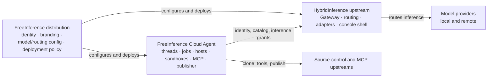

# FreeInference / HybridInference 系统、发行版与服务边界

**日期：** 2026-09-01

**状态：** 当前架构；Cloud Agent 已完成独立服务切换，网关保持契约端

**覆盖仓库：** `hybridInference`、`freeinference-cloud-agent` 与 deployment distribution overlay

**文档级别：** 跨仓架构说明；各仓代码、manifest 与版本化迁移计划是实现真值

**本仓规范源：**

- [HybridInference architecture](../../developer/architecture.md)
- [Configuration](../../developer/configuration.md)
- [Public path table](../../developer/public-path-table.md)
- [Cloud Agent repo split plan](../plans/2026-08-03-cloud-agent-repo-split.md)
- [Cloud Agent split manifest](../plans/cloud-agent-split-manifest.md)

**相关说明：**

- [Agent 会话连续性与共享沙盒架构](2026-09-01-agent-session-continuity-architecture.zh.md)
- [Agent 沙盒安全模型与能力边界](2026-09-01-agent-sandbox-security-model.zh.md)
- [Agent Operation 可观测性与资源归属设计](2026-09-01-agent-operation-observability-design.zh.md)

## 1. 目的

本文回答四个容易混淆的问题：

1. HybridInference 上游与 FreeInference 运营产品分别拥有哪类能力？
2. Distribution overlay 为什么不是另一个 application fork？
3. Cloud Agent 为什么是独立服务，而不是 Gateway 的一个子模块？
4. 拆分后，身份、模型能力、配额、MCP、任务状态和数据分别由谁决定？

目标不是追求仓库数量，而是让每项状态只有一个 authority，并让依赖方向与 authority 一致。

## 2. 设计原则

### 2.1 按 authority 与生命周期拆，不按目录名拆

一段代码是否应该独立，主要看：

- 它拥有什么状态；
- 谁对授权结果负责；
- 失败时影响哪类流量；
- 如何扩缩容；
- 谁持有高权限 credential；
- 发布节奏是否与其他组件一致。

文件移动只是这些决策的结果。

### 2.2 一项状态只有一个 owner

缓存和 projection 可以有多份；能改变授权或业务结果的 truth 只能有一份。跨服务消费者通过显式 contract 查询 owner，不复制表、不共享 ORM、不导入对方内部 package。

### 2.3 发行版依赖上游，上游不依赖发行版

```text
FreeInference distribution ──depends on──> HybridInference upstream
Example distribution       ──depends on──> HybridInference upstream

HybridInference upstream   ──must not import──> deployment distribution
```

### 2.4 Cloud Agent 只通过 HTTP contract 依赖 Gateway

```text
Cloud Agent ──identity/model/grant HTTP──> HybridInference Gateway

HybridInference backend ──must not import──> cloud_agent.*
Cloud Agent             ──must not import──> serving.* / routing.*
```

### 2.5 Contract 先于迁移，删除晚于切换

迁移顺序：

1. 在 owner 一侧建立 contract；
2. 消费方改为 HTTP；
3. 对比旧路径与新路径；
4. 切换入口；
5. 观察稳定窗口；
6. 独立变更删除旧 wiring；
7. 保留或归档历史数据，不在切换窗口做隐式数据重写。

## 3. 当前系统分层



这里有三种不同边界：

- **Upstream boundary：** 通用软件与某个站点的运营内容分离；
- **Distribution boundary：** 同一通用软件在不同部署中的配置、品牌与策略分离；
- **Service boundary：** 短生命周期推理网关与长生命周期 Agent 控制/执行面分离。

它们不能合并成一个“FreeInference 代码目录”的概念。

## 4. HybridInference 上游

### 4.1 职责

HybridInference 是通用 LLM inference gateway，负责：

- OpenAI-compatible 与 Anthropic-compatible HTTP surface；
- model registry、alias、visibility 与 reasoning-effort catalog；
- local/remote provider adapters；
- Fixed、RouteWise 等 routing strategy；
- health、fallback 与 circuit breaker；
- 用户、API key、role 与 account daily quota；
- inference request log、token/cost ledger；
- cross-service identity token；
- Agent model capability grant；
- public console shell 与 edge path routing。

### 4.2 不负责

HybridInference 不再负责：

- Agent thread、job、attempt、lease 与 event store；
- runner host 注册、调度和 heartbeat；
- sandbox、workspace、terminal 与 native Agent session；
- source-control connection、patch publication 与 PR lifecycle；
- MCP catalog、用户 MCP connection、tool relay 与 tool allowlist；
- Agent per-attempt resource telemetry；
- Agent frontend 的业务页面。

### 4.3 上游中立性

上游代码与默认构建不得包含某个部署的：

- 真实 host、port、account id 或 credential；
- 真实 model catalog、provider key 与 private route；
- production database、backup、tunnel 与 machine operation；
- branding、Terms、support policy 与组织专属页面；
- 未经抽象的 deployment feature switch。

上游可以包含 schema、resolver、extension seam、example overlay 与 neutral defaults。

## 5. FreeInference distribution

### 5.1 定义

Distribution 是对上游的可运营组合，不是上游源码 fork。它拥有：

- deployment identity 与公开站点信息；
- 真实 `models.yaml`、`routing.yaml`、`alerts.yaml`；
- provider endpoint、模型 alias 与可见性策略；
- branding、用户内容与 Terms；
- Compose/env inputs、部署目标与运维说明；
- 与该部署相关的 feature flags、secret provisioning 和 release policy。

Credential 仍由 secret/environment system 提供，不能写入 manifest。

### 5.2 Overlay 结构

```text
distributions/<name>/
├── distribution.yaml
├── config/
│   ├── models.yaml
│   ├── routing.yaml
│   └── alerts.yaml
├── deploy/
│   ├── *.env
│   └── docker-compose.yml
└── content/ or branding assets
```

公开上游只保留 `distributions/example/` 教学实现。真实运营 overlay 可以在部署环境中独立管理和挂载，不能要求上游 import 其 Python/TypeScript 实现。

### 5.3 配置解析

每类配置独立按以下优先级解析：

```text
explicit environment path
        > active distribution manifest path
        > neutral built-in default
```

Manifest 相对路径以 manifest 所在目录为基准；environment 相对路径以进程 working directory 为基准。

Distribution loader 有两种模式：

- `dark`：加载和校验 manifest，只记录如果启用将改变什么，不改变当前解析结果；
- `active`：manifest 成为真实配置来源，加载失败时拒绝启动。

未知 mode 降级为 `dark`，防止拼写错误意外改变生产行为。

### 5.4 Overlay 不变量

1. Manifest 不存 secret，也不做 secret interpolation。
2. Environment override 胜过 manifest，并必须记录来源。
3. Active manifest 无法读取时 fail closed，不能静默回到另一个 model registry。
4. 同一 image 可以由不同 distribution 配置，而不重新修改源码。
5. Example overlay 必须明确 opt-in，不能被自动选成生产配置。
6. 一个运行实例必须能报告 distribution id、release 与配置来源/hash。

## 6. Cloud Agent 独立服务

### 6.1 拆分依据

Inference Gateway 与 Agent Control Plane 的运行特征不同：

| 维度 | HybridInference Gateway | Cloud Agent |
|---|---|---|
| 核心工作 | 高频、短生命周期模型请求 | 长生命周期 thread/job/sandbox |
| 持久状态 | 用户、API key、quota、model catalog、billing log | job、attempt、lease、host、workspace、session |
| 扩缩容 | 跟随 request/QPS | 跟随并发任务、host capacity 与 retained disk |
| 高权限 | Provider credential、model policy | Source-control、sandbox lifecycle、publisher、MCP connection |
| 失败语义 | 单请求失败、route fallback | retry/fence、native resume、LOST、publication reconcile |
| 发布节奏 | API/provider/routing 变化 | Agent CLI、sandbox image、host/runtime 变化 |

继续共享进程、数据库和 signing secret 会扩大爆炸半径，并让两套生命周期互相阻塞。

### 6.2 Cloud Agent owner

Cloud Agent 当前拥有：

- `agent_threads`、`agent_jobs`、`agent_attempts` 与 canonical event stream；
- job scheduling、claim、lease、retry 与 fencing；
- runner host、capability、heartbeat 与 admission；
- sandbox group、membership、native session 与 workspace；
- repository connection 与 source preparation；
- per-user MCP connection、registry、credential encryption、relay 与 tool filtering；
- patch capture、secret scan coordination 与 trusted publisher；
- Agent resource sampler 与 attempt telemetry；
- standalone `/agents` web application。

### 6.3 Gateway owner

Gateway 继续拥有：

- 用户 account、status 与 role；
- model registry、alias、visibility 与 account preferences；
- inference grant row、签名与验证；
- direct request 与 Agent request 的同一 daily quota；
- inference routing、provider credential 与 cost ledger；
- `api_logs.agent_job_id` 的 job attribution；
- public identity token signing key 与 JWKS。

## 7. Cross-service contracts

### 7.1 Identity

Gateway 提供：

| Endpoint | Caller | 作用 |
|---|---|---|
| `GET /v1/identity/jwks` | Cloud Agent | 获取 identity JWT 验证公钥 |
| `POST /v1/identity/code` | 登录后的 gateway frontend | 创建一次性授权 code 与 PKCE challenge |
| `POST /v1/identity/token` | Cloud Agent | 使用 code + verifier 换取短期 identity token |

不变量：

- Gateway 保留 private signing key；Cloud Agent 只得到 public JWKS；
- identity token 有明确 issuer、audience、subject 与 expiry；
- code 一次性消费，并绑定 PKCE；
- account status/role 真值仍在 Gateway；
- 未配置 cross-service identity 时 endpoint 明确 404，不生成临时共享 secret fallback。

### 7.2 Model catalog 与 user status

| Endpoint | 作用 |
|---|---|
| `GET /internal/model-catalog?user_id=...` | 返回该用户真实可见的 canonical model、alias 与 reasoning-effort domain |
| `GET /internal/users/{user_id}/status` | 返回用户是否存在、是否 active、status 与 role |

Catalog 不能复用 public `GET /v1/models`，因为 public route 的认证语义与 cross-service identity 不同，可能返回 anonymous catalog 并静默缩窄高级用户能力。

MCP 不在 Gateway 提供 catalog endpoint。MCP registry、用户 connection 与 relay 已由 Cloud Agent 单独拥有。

### 7.3 Inference grant

Gateway 提供：

| Endpoint | 语义 |
|---|---|
| `POST /internal/agent-grants` | 幂等 mint 一个 attempt 的短期 model capability |
| `POST /internal/agent-grants/{id}/renew` | 在 owner/状态仍有效时延长一个 bounded TTL step |
| `GET /internal/agent-grants/{id}/usage` | 读取 billing ledger 中该 external job 的 cost/token/call projection |
| `POST /internal/agent-grants/{id}/revoke` | 加速失效；安全性仍由短 TTL 兜底 |

Grant 包含：

- Gateway user id；
- external job/attempt id；
- canonical allowed model list；
- expiry 与 revoked state。

Grant 不包含：

- source-control permission；
- MCP scope；
- Cloud Agent lease/fence truth；
- per-job dollar budget；
- Gateway signing secret。

### 7.4 Inference request

Sandbox 使用 `agr` grant 调用普通 inference surface。Gateway 验证：

1. token 结构、签名、row、expiry 与 revoked state；
2. user 仍存在且 active；
3. model 在 grant scope 内；
4. user preference 没有禁用该 model；
5. account active API key 对应的 daily quota；
6. per-user concurrency 等直接路径同样适用的 policy。

请求最终以 owner user 计费，并把 external job id 写入 `api_logs.agent_job_id`。Usage endpoint 读取该 ledger；Agent 自报 token/cost 不是计费 authority。

### 7.5 Internal dispatch authentication

Model catalog、user status 与 grant routes 使用独立的 machine-to-machine dispatch credential。必须在 router 层统一保护整组 routes，避免新增 route 时遗漏 auth。

Dispatch credential 只允许调用明确的 internal contract；它不等于用户 identity、model grant 或 control-plane admin token。

## 8. MCP ownership 修订

早期设计把 MCP registry、upstream credential 与 proxy 留在 Gateway。当前实现已将其整体移到 Cloud Agent，因为 Cloud Agent 同时拥有：

- 用户选择的 MCP connection；
- job requested server list；
- attempt fence；
- sandbox-facing MCP token；
- tool event 与 cancellation 上下文。

当前路径：

```text
sandbox --mcp-scoped token--> Cloud Agent MCP relay
        -> per-user registry/credential resolution
        -> tool allowlist/filter
        -> upstream MCP server
```

Gateway 不再签发或接受 MCP token，也不回答 MCP catalog。把 MCP list 同时放回 Gateway 会重新制造两个 truth source。

## 9. Data ownership

| 数据 | Owner database | 复制策略 |
|---|---|---|
| Users、API keys、roles、status | Gateway | Cloud Agent 只存 external user id；按需查询状态 |
| Model registry/visibility | Gateway config/store | Cloud Agent 缓存只能短期，授权时以 Gateway answer 为准 |
| Inference grants | Gateway | Cloud Agent 存 grant id/token 生命周期，不验证签名真值 |
| Inference billing logs | Gateway | Cloud Agent 通过 usage contract 读取 projection |
| Threads/jobs/attempts/events | Cloud Agent | Gateway 不保存或查询 Agent lifecycle |
| Runner hosts/capability | Cloud Agent | Gateway 不参与 scheduling |
| Sandbox/session/workspace metadata | Cloud Agent | Gateway 不创建第二份 residency state |
| Source-control connections | Cloud Agent | Credential 在 Cloud Agent key domain 下加密 |
| MCP connections/registry | Cloud Agent | Gateway 无 mirror |
| Old pre-split Agent tables | Gateway historical DB | Read-only history，不作为新服务运行真值 |

共享同一个 Postgres instance 但使用不同 database 仍属于数据所有权分离；共享 schema/table 不属于。

## 10. Edge 与 console routing

Public edge 只需暴露 Next.js console。Console 的 `rewrites()` 是 public path table 的真值：

```text
client -> external edge -> Next.js console
                           ├── /v1, /auth, /internal/... -> Gateway
                           ├── /agents/api/*             -> Cloud Agent control plane
                           ├── /agents/*                 -> Cloud Agent web app
                           └── own pages
```

Cloud Agent proxy 规则只有在 web 与 control-plane 两个 destination 都配置时才生成。否则 `/agents` 返回 404，这是“此部署未启用 Agent”的真实状态。

两条 routing 规则是 load-bearing：

1. `/agents/api/:path*` 必须先于 `/agents/:path*`，否则 API 请求会收到 HTML；
2. `/agents` 使用 `beforeFiles`，保证本地文件 route 不能意外抢占 standalone service。

Rewrite 在 frontend build 时写入 routes manifest。部署或回滚 Cloud Agent proxy 需要重新构建 console，不能只在运行时修改 environment。

## 11. Failure semantics

| 故障 | Owner | 对外行为 |
|---|---|---|
| Identity key 未配置 | Gateway | Identity routes 404；Cloud Agent login unavailable |
| Identity key 配置错误 | Gateway | 明确 5xx；不签发不可信 token |
| Internal dispatch auth 缺失/错误 | Gateway | Internal contract 拒绝或不暴露 |
| Model catalog 不可解析 | Gateway | 4xx/5xx；Cloud Agent 不猜测 alias/visibility |
| User suspended | Gateway | Grant mint/renew/model call 拒绝；Cloud Agent archive/提示按 status contract 处理 |
| Grant revoke 丢失 | 两服务间网络 | TTL 到期后自动失效 |
| Gateway store/ledger 不可用 | Gateway | Grant auth/usage fail closed；不返回“零消费” |
| Cloud Agent DB 不可用 | Cloud Agent | Job/fence 不可判定，停止 admission；Gateway 现有 inference 不受影响 |
| Runner pool 不可用 | Cloud Agent | Job queued/unavailable；Gateway inference 不受影响 |
| Agent web/control URL 未配置 | Console build | `/agents` 404；其他 Gateway 路径正常 |
| Cloud Agent deployment rollback | Cloud Agent | 停止创建新任务或回到兼容版本，不重新启用已删除的 in-gateway Agent store |

独立故障域是拆分的直接收益：Agent scheduler/sandbox 故障不应阻断普通 inference，Provider 路由故障也不应损坏 Agent job ledger。

## 12. Migration 与 cutover 规则

### 12.1 Move-as-is

迁移阶段只改 import、path、configuration 与 contract adapter。重命名、拆大文件、格式化和行为优化分开提交，保证 parity diff 可审核。

### 12.2 No shared signing secret

- Gateway identity private key 不进入 Cloud Agent；
- Gateway grant signing secret 不进入 Cloud Agent；
- Cloud Agent control/worker/session/MCP token 使用自己的 key domain；
- source-control 与 MCP encrypted credential 使用 Cloud Agent 自己的 encryption key；
- ciphertext 如果依赖旧 key，迁移时必须 decrypt/re-encrypt，不能复制 bytes 后等待运行时报错。

### 12.3 Historical data

旧 Agent thread/job 表保留为 read-only history，不自动迁移到新 DB。新服务从切换点开始拥有新 job truth。需要保留用户历史时，提供明确 archive/export surface，而不是让两个服务同时写同一组记录。

### 12.4 Reversible cutover

每个阶段要有：

- contract compatibility test；
- old/new response comparison；
- staging smoke；
- frontend proxy 与 backend deploy 的有序切换；
- known-good image/config revision；
- rollback 对已有数据的说明；
- 删除旧 wiring 的独立变更。

删除旧 schema/table 不是应用 rollback 的前提，也不应与首次 traffic cutover 同窗。

## 13. Dependency enforcement

CI 应至少检查：

- HybridInference 不 import `cloud_agent` / `cloud_agent_host`；
- Cloud Agent 不 import `serving` / `routing`；
- Gateway Agent contract 有 OpenAPI/schema tests；
- Cloud Agent contract mirror 与 Gateway response shape 一致；
- Distribution-independent startup 不需要真实 overlay；
- Neutral build 不包含运营 host、credential 或 private catalog；
- Public path table 与 `next.config.js` 同步；
- Agent code 删除后 Gateway 普通 inference、auth、quota、SSE 仍通过回归测试。

## 14. Change ownership指南

新增需求先按下表决定落点：

| 需求 | 默认 owner |
|---|---|
| 新 provider adapter、model router、quota policy | HybridInference |
| 某部署新增模型、权重、域名、branding | Distribution overlay |
| Agent runtime、sandbox、Fork、terminal、publisher | Cloud Agent |
| 用户登录 claim 或 account role | HybridInference identity |
| Agent 需要读取新的 Gateway truth | 先在 Gateway 设计 HTTP contract |
| Agent MCP provider/connection/tool filtering | Cloud Agent |
| `/agents` public path | Console edge routing + Cloud Agent deploy |
| 跨服务成本显示 | Gateway billing projection + Cloud Agent UI consumer |

如果某项功能需要两边共同完成，仍必须指定一个语义 owner；另一边只实现 transport、projection 或 enforcement adapter。

## 15. 架构不变量

1. HybridInference 上游不读取真实 FreeInference distribution implementation。
2. Distribution 不修改上游业务代码来表达配置差异。
3. Cloud Agent 与 Gateway 之间只有版本化 HTTP contract，没有 Python import 或共享 ORM。
4. User、model visibility、quota 与 billing 的唯一 owner 是 Gateway。
5. Job、attempt、lease、sandbox、MCP 与 publisher 的唯一 owner 是 Cloud Agent。
6. Inference grant 只缩小 capability，不重新实现 per-job spending budget。
7. Grant 以短 TTL 自失效，revoke 只是加速。
8. Agent 请求与直接请求应用同一 user quota 语义。
9. `api_logs.agent_job_id` 只做 attribution，不使 Gateway 重新拥有 job lifecycle。
10. `/agents` proxy 未配置时明确 404，不回退到已删除的内置 Agent UI。
11. 迁移期间可以 dual-read/compare，不允许长期 dual-write authority。
12. 任何 fallback 都必须保留安全、授权与数据所有权边界，不能为了可用性绕过 contract。

## 16. 实现导航

### HybridInference

| 职责 | 路径 |
|---|---|
| Gateway architecture | `apps/backend/serving/`、`apps/backend/routing/` |
| Distribution resolver | `apps/backend/serving/config/distribution.py` |
| Identity contract | `apps/backend/serving/servers/routers/identity.py` |
| Model catalog contract | `apps/backend/serving/servers/routers/internal_lookups.py`、`apps/backend/serving/model_catalog.py` |
| Grant lifecycle | `apps/backend/serving/grants.py`、`apps/backend/serving/servers/routers/agent_grants.py` |
| Grant inference auth/quota | `apps/backend/serving/grant_auth.py`、`apps/backend/serving/servers/auth.py` |
| Billing attribution | `apps/backend/serving/storage/log_schema.py` 与 inference route metadata |
| Edge routing | `apps/frontend/next.config.js` |

### Cloud Agent

| 职责 | 路径 |
|---|---|
| Control plane/API | `cloud_agent/api/` |
| Agent store/scheduler | `cloud_agent/storage/`、`cloud_agent/host_pool.py`、`cloud_agent/api/hosts.py` |
| Gateway client/contracts | `cloud_agent/gateway.py`、`cloud_agent/grants.py`、`contracts/` |
| MCP | `cloud_agent/mcp_registry.py`、`cloud_agent/api/mcp_relay.py` |
| Host/sandbox/workspace | `cloud_agent_host/` |
| Publisher | `cloud_agent/publisher.py`、`cloud_agent/publish_worker.py` |
| Standalone web | `web/` |

跨仓修改应从 owner 的 contract 和 acceptance test 开始，而不是从复制一段内部实现开始。
